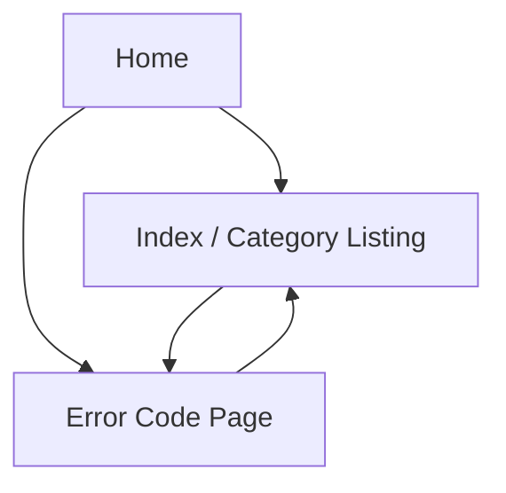

## 1. Product Overview
ErrorCodesIndex.com is a fast, SEO-first static reference site for looking up software error codes.
It helps developers quickly find the exact error-code page and supporting context via a locked, predictable URL structure.

## 2. Core Features

### 2.1 User Roles
| Role | Registration Method | Core Permissions |
|------|---------------------|------------------|
| Visitor | None | Browse error-code pages and supporting index pages |

### 2.2 Feature Module
Our requirements consist of the following main pages:
1. **Home**: site search entry, primary category navigation, recently added/updated listing.
2. **Error Code Page**: canonical error-code content (verbatim), metadata, internal links to related pages.
3. **Index / Category Listing**: browse by platform/vendor/product, paginated lists, internal linking.

### 2.3 Page Details
| Page Name | Module Name | Feature description |
|-----------|-------------|---------------------|
| Home | Global navigation | Link to core index pages (platform/vendor/product) and policies (robots/sitemap as files) |
| Home | Site search | Filter and jump to an error-code page by code string and optional product/vendor keywords |
| Home | Highlights | Show recently added/updated error codes (from content metadata) |
| Error Code Page | Locked URL + canonical | Render at the locked pattern (e.g., `/error/<code>/`); output canonical `<link rel="canonical">` matching the locked URL |
| Error Code Page | Verbatim content rendering | Render the error-code page body imported from the provided Google Doc **verbatim** (no rewriting, no auto-summarization) |
| Error Code Page | Structured data | Emit JSON-LD schema for a reference/knowledge page and include key fields from frontmatter (code, title, product/vendor, lastUpdated) |
| Error Code Page | SEO metadata | Set title/description/OG tags from frontmatter; prevent duplicates through canonicals and locked routes |
| Error Code Page | Related navigation | Link to parent index pages (vendor/product) and related error codes (by shared tags) |
| Index / Category Listing | Locked listing URLs | Render locked browse routes (e.g., `/vendor/<vendor>/`, `/product/<product>/`, `/platform/<platform>/`) |
| Index / Category Listing | Listing + pagination | List error codes with stable sorting; paginate with static pages and canonical/prev/next links |
| Index / Category Listing | Internal linking | Link to error-code pages and cross-link between indices (vendor ↔ product ↔ platform) |
| Site-wide | Sitemap + robots | Generate sitemap.xml and robots.txt aligned to the locked URL structure |
| Site-wide | Duplicate prevention | Enforce single canonical URL per entity; avoid alternate slugs/paths; 404 for non-conforming URLs |

## 3. Core Process
Visitor Flow:
1. Visitor lands on Home.
2. Visitor searches for an error code or browses an index (vendor/product/platform).
3. Visitor opens an Error Code Page.
4. Visitor navigates to related codes or back to an index.

Content/Admin Flow (operational, not an app UI):
1. Maintainer exports or syncs the provided Google Doc into the repository content folder.
2. Build validates that each error-code entry matches the locked URL pattern and required metadata.
3. Astro builds static output, emitting sitemap/robots/canonicals/schema.

