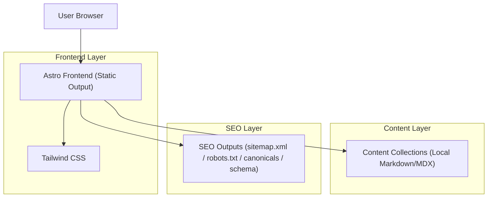
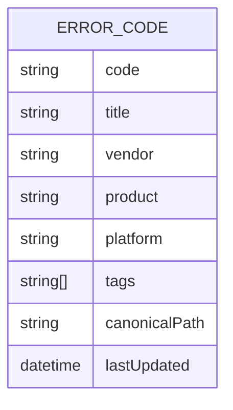

## 1.Architecture design

## 2.Technology Description
- Frontend: Astro@5 + Tailwind CSS@3
- Backend: None (static output)
- Content: Astro Content Collections (Markdown/MDX + schema validation)

## 3.Route definitions
| Route | Purpose |
|-------|---------|
| / | Home page with search + primary browse entry points |
| /error/<code>/ | Locked error-code detail page (canonical source of truth per code) |
| /vendor/<vendor>/ | Vendor browse listing (static pagination if needed) |
| /product/<product>/ | Product browse listing (static pagination if needed) |
| /platform/<platform>/ | Platform browse listing (static pagination if needed) |
| /sitemap.xml | Search engine sitemap containing only canonical locked URLs |
| /robots.txt | Crawl directives and sitemap location |
| /404 | Non-conforming URL fallback and hard-not-found pages |

## 4.API definitions (If it includes backend services)
N/A (no backend services).

## 6.Data model(if applicable)
### 6.1 Data model definition

### 6.2 Data Definition Language
N/A (content stored as repository files via Content Collections).

### Implementation constraints (must-haves)
- Static output only: use Astro static build (no SSR runtime requirements).
- Locked URL structure: derive every route from normalized metadata (e.g., `code`), and fail the build if content would generate a different path.
- Verbatim import rule: the body content for each error-code page must be imported from the provided Google Doc without rewriting. (Maintain as a source file snapshot in-repo and transform only for formatting compatibility; do not alter wording.)
- SEO:
  - Canonicals: every page emits exactly one canonical URL matching the locked route.
  - Sitemap: include only canonical URLs; exclude 404 and any non-canonical variants.
  - Robots: allow crawling of canonical routes; disallow any utility/source paths.
  - Schema: emit JSON-LD per error-code page (type selection based on SEO strategy; include `headline`, `description`, `dateModified`, and identifier `code`).
